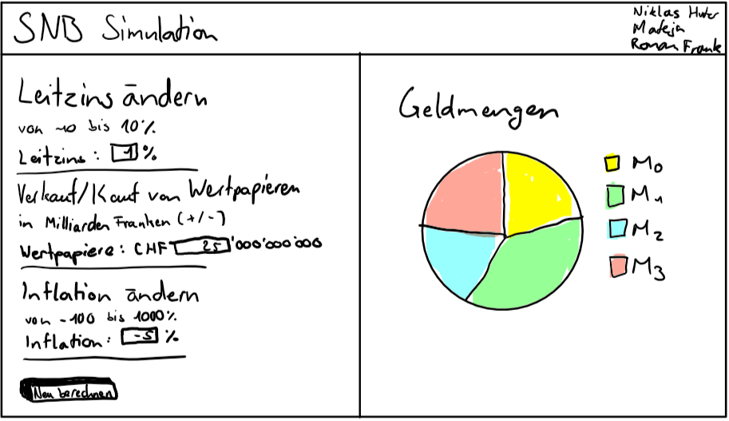
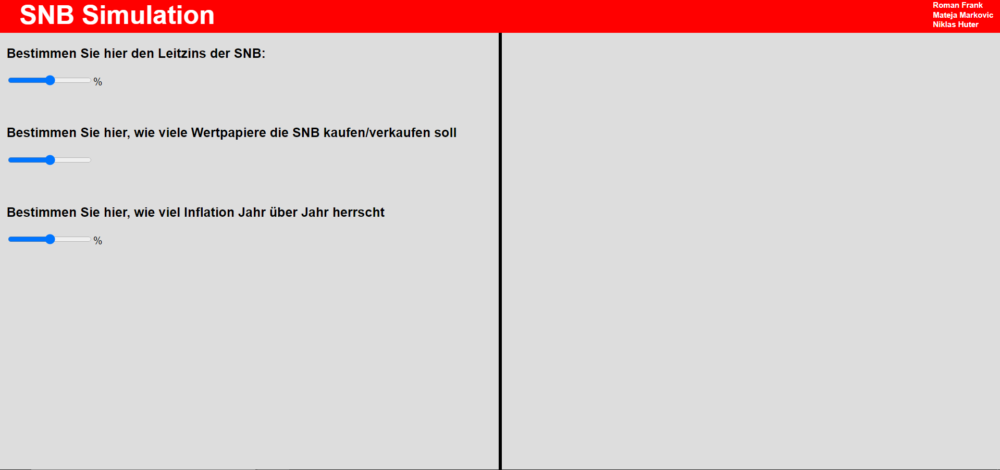
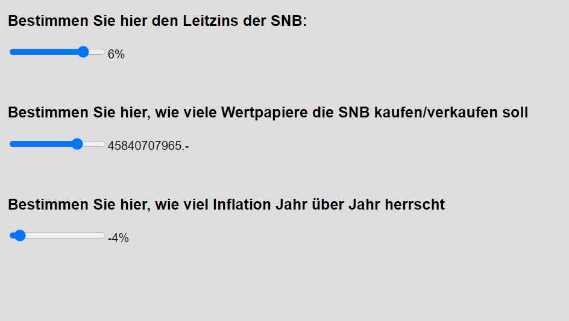
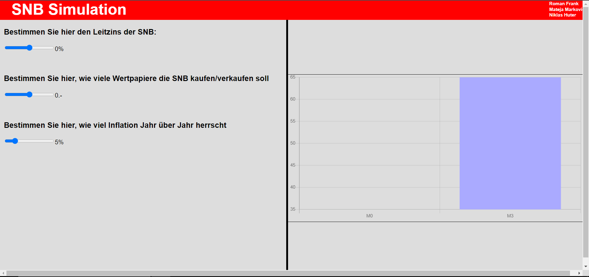
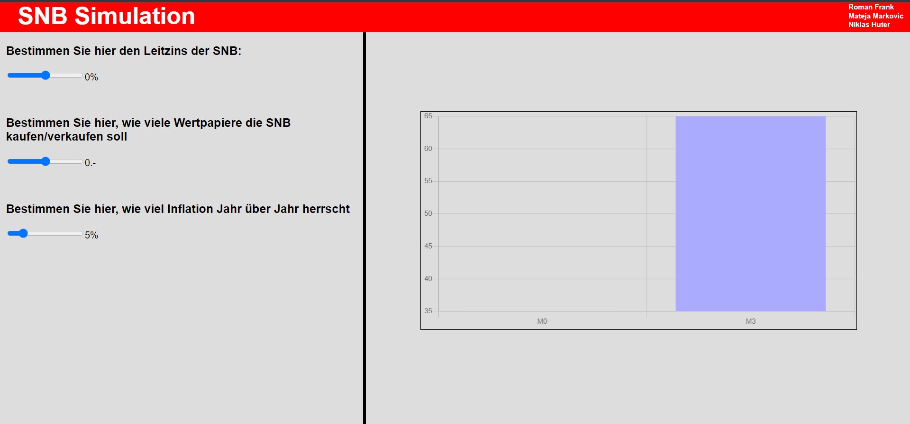
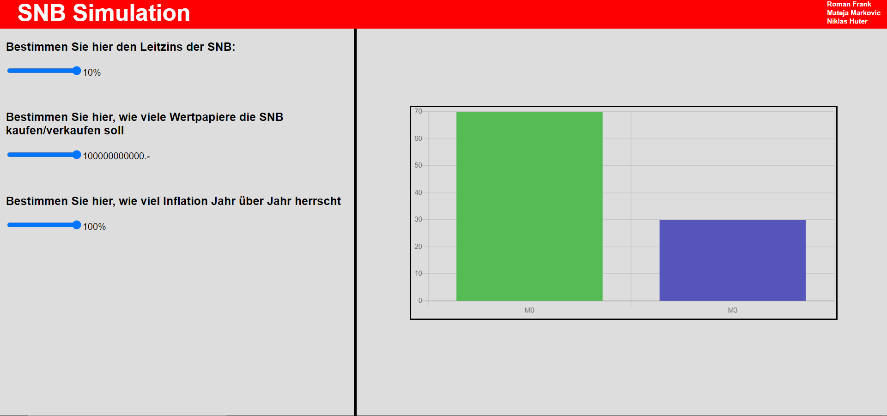
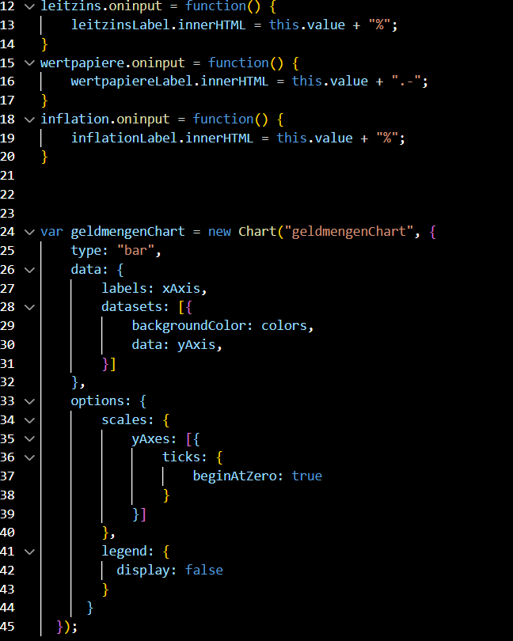
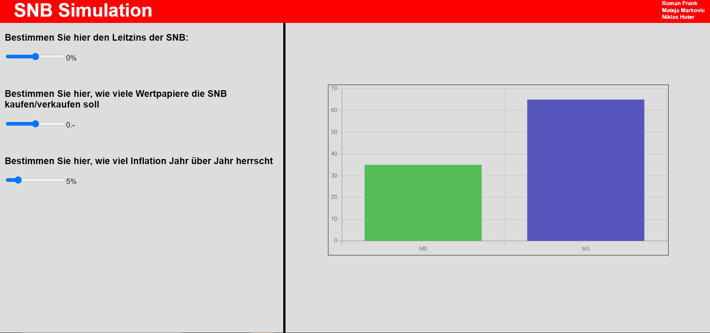
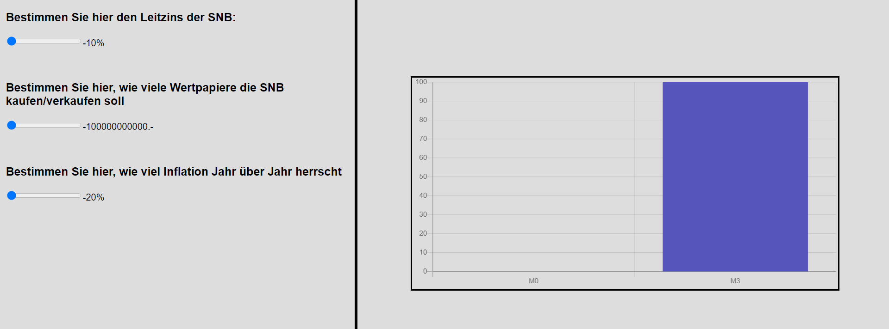

# Foxtrot Project Doku
Der Auftrag ist in unserer Gruppe eine Webapp zu erstellen. In dieser Webapp sollen verschiedene Wege aufzeigen wie die SNB Geldmengen steuert. Genaueres dazu finden sie im Pflichtenheft. 

Als erstes mussten wir uns für 3 der vielen möglichen Wege entscheiden. Um uns zu entscheiden, machten wir uns erstmal schlau. Schlussendlich entschieden wir uns für die folgenden drei Wege. 

1. Die Erhöhung des Leitzinses
2. Quantitative Lockerung
3. Inflation

## Erklärung

**Erhöhung des Leitzinses**

Die SNB erhöht den Leitzins, zu dem sich Geschäftsbanken ihr Geld holen. Also was für einen Zins sie der SNB zurückzahlen müssen, bei geliehenem Geld. Es ist ein Instrument zur Geldmarktsteuerung. Vom Leitzins hängt die Höhe der Zinserträge von Spareinlagen und die höhe von Zinssätzen bei Krediten. 

***
**Quantitative Lockerung**

Die Quantitative Lockerung ist eine geldpolitische Massnahme, die dazu bestimmt ist, Zinsen zu verringern und die Geldmenge zu erheben. Wird angewandt wenn reguläre geldpolitische Massnahmen keinen Nutzen haben. Zum Beispiel wenn die Zinsen bereits bei Null sind oder so ähnlich. 
***
**Inflation**

Inflation steigt und sinkt mit der Konjunkturkurve. Wenn wir jetzt in einer Rezession sind ist die Inflation tief. Währenddessen will die SNB die Rezession verbessern, indem sie Investitionen vorantreibt. Das macht sie, indem sie den Leitzins senkt. Dies gilt natürlich auch umgekehrt. So kommt man darauf, dass wenn Inflation tief ist die M0 Geldmenge steigt und wenn Inflation hoch ist die M0 Geldmenge sinkt.

***

## **Design**

Nachdem wir uns über die verschiedenen Wege informiert hatten, brainstormten wir ein paar Design-Ideen. Wir warfen zwar viel Unsinn in den Raum, konnten uns schlussendlich aber einigen und eine Skizze zusammenstellen. 

## **Arbeitsprozess**
Für den Aufbau der Webseite orientierten wir uns an unserem Design. Wir entschieden uns für Schieberegler um die verschiedenen Eingaben zu machen, da es von einem Sicherheitsstandpunkt aus besser ist. So können keine schädlichen Eingaben wie in normalen Textfeldern gemacht werden. Wir können auch die Spannweite der Eingabe besser einstellen. 

Danach mussten wir noch dafür sorgen das auch der Wert den wir eingaben angezeigt wird. 

Jetzt war es Zeit das Diagramm einzufügen und funktionsfähig zu machen. Dafür werden wir Javascript benötigen. Beim Einfügen des Charts hatten wir Probleme dabei die grösse korrekt einzustellen, Roman konnte es aber mit einem neuen DIV-Container lösen. 

Das Problem kam davon, dass das Diagram auf einem Canvas ist, der sich von alleine an die Grösse anpasst. Konnte aber mit dem vorhergenannten DIV gelöst werden. 

Dazu hatten wir noch Probleme damit das der Chart bei 0 anfängt. 

Hier seht ihr einen kleinen Ausschnitt unseres JS-Codes, der zeigt wie es gelöst wurde, dass der Chart bei 0 beginnt. 

Zu dem Zeitpunkt waren der Aufbau und das Design der Webseite fertig und der Logik-Teil mit den ganzen Funktionen im Hintergrund konnte relativ schnell fertiggestellt werden. Unten sehen sie noch ein paar Beispiele der Charts mit bestimmten eingegeben Webseiten. 

## **Reflexion**
### Mateja
Wir hatten einen recht holprigen Start. Wir waren wohl alle entäuscht das wir die Gruppen nicht selber wählen konnten und einfach eingeteilt wurden. Aber naja wir haben es dann auch akzeptiert und konnten mit der Arbeit anfangen. Die Arbeit an sich lief eigentlich relativ gut. Wir hatten einfach grosse Probleme mit den komischen Deadlines die wir erhielten. Die Zeitpunkte für Abgaben und ähnlichem war so komisch, das sie komplett an uns vorbeizogen. Ausserdem hatte ich mit einigen Problemen zu kämpfen und war oft Krank und bei Untersuchungen, weshalb ich die Lektionen öfters verpasste. Dadurch nahm unsere Produktivität ab. Es fehlte auch generell die Motivation an diesem Projekt zu arbeiten, da wir eine Menge andere Projekte hatten, mit genauen Angaben, auf die wir aufbauen konnten. In diesem waren wir lange Zeit einfach planlos am ausprobieren. Schlussendlich konnten wir uns aber noch zusammenreissen und ein unserer Meinung nach zufriedenstellendes Projekt machen. 

### Roman
Die Aufgabenstellung war nicht sehr intuitiv oder gut beschrieben. Mir war nicht von Anfang an klar, was wir überhaupt machen sollten. Trotzdem hatten wir uns entschieden, das Projekt einfach anzufangen, jedoch hat GitHub nicht kooperieren wollen, und so sind wir hinter den Zeitplan gefallen. Bei uns fehlte die Motivation und/oder Ahnung, das Projekt auf das originelle Abgabedatum fertigzustellen. Wir nutzten die Chance, noch bis am 23.12 etwas hinzuzaubern und so habe ich mich ins Thema vertieft, nachdem ich andere gefragt habe, was man genau machen soll. Ich finde, unser Endprodukt sieht gut aus und entspricht den Anforderungen relativ gut, solange ich sie richtig verstanden habe.

### Niklas

